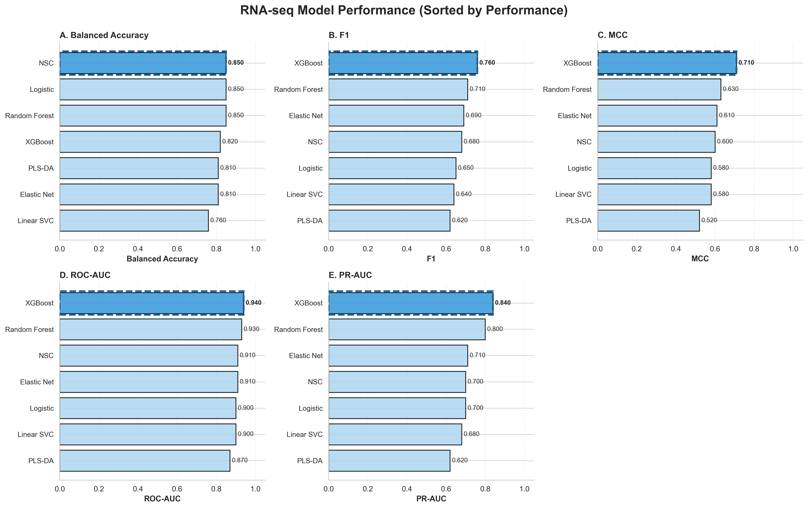
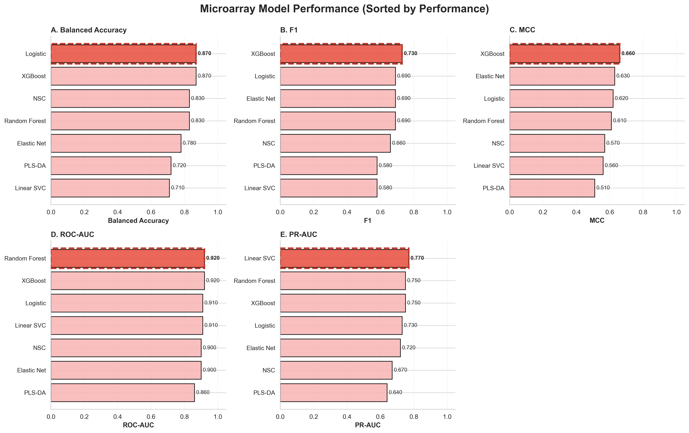
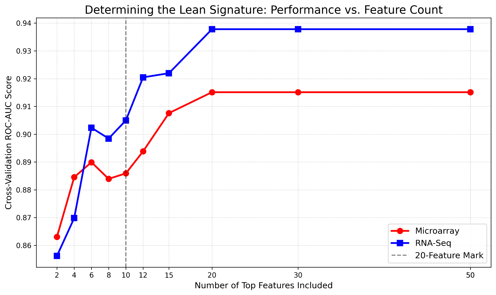

# Neuroblastoma RNA-seq and Microarray Machine Learning Project

Machine learning project comparing RNA-seq and microarray gene-expression data for predicting death from disease in a neuroblastoma cohort.

## Project overview

This project uses gene expression profiles from 498 primary neuroblastoma patients to build and compare predictive models for clinical endpoints. The main target is **death from disease**, with additional exploration of high-risk status, INSS stage, and progression.

The analysis compares two expression platforms:

- **RNA-seq**: richer transcript-level information and discovery potential.
- **Microarray**: more established, lower-cost, clinically pragmatic platform.

The group report found that XGBoost was the strongest overall classifier, with ROC-AUC around 0.937 for RNA-seq and 0.919 for microarray. The project also evaluates simpler interpretable baselines such as logistic regression and nearest shrunken centroid models.

## Repository structure

```text
neuroblastoma-rnaseq-microarray-ml/
├── data/                  # Raw data files are not committed if restricted/large
├── notebooks/             # Clean analysis notebooks
├── figures/               # Saved plots for README/reporting
├── results/  
├── report.pdf
├── presentation.pdf
├── README.md
├── requirements.txt
└── .gitignore
```

## Notebooks

1. `01_EDA.ipynb`  
   Loads RNA-seq, microarray, and patient metadata; checks sample alignment; visualizes clinical distributions; performs PCA.

2. `02_nsc_logistic_models.ipynb`  
   Builds logistic regression and nearest shrunken centroid baselines for RNA-seq and microarray data using cross-validation.


## Main methods

- Patient/sample ID alignment
- Missing-value checks and complete-case filtering
- Feature scaling with `StandardScaler`
- Variance filtering
- Correlation filtering for redundant features
- Recursive feature elimination
- Cross-validation using stratified folds
- Model comparison using ROC-AUC, PR-AUC, F1-score, balanced accuracy, specificity, sensitivity, and MCC

## Key findings

- PCA did not show clean natural separation by death outcome or INSS stage, supporting the need for supervised learning.
- A compact gene-expression signature captured most of the predictive signal.
- XGBoost achieved the strongest overall performance across RNA-seq and microarray models.
- RNA-seq provided richer biomarker discovery potential, including transcripts not represented by microarray probes.
- Microarray showed stronger recall in the final comparison, making it potentially more pragmatic for immediate clinical screening.


## Model performance summary

The table below summarizes the main classifier comparison for predicting **death from disease** using RNA-seq and microarray expression features.

### RNA-seq model performance

| Model | Accuracy | Balanced Accuracy | Specificity | F1 | MCC | ROC-AUC | PR-AUC |
|---|---:|---:|---:|---:|---:|---:|---:|
| XGBoost | 0.91 | 0.82 | 0.97 | 0.76 | 0.71 | 0.94 | 0.84 |
| Random Forest | 0.86 | 0.85 | 0.86 | 0.71 | 0.63 | 0.93 | 0.80 |
| Elastic Net | 0.87 | 0.81 | 0.91 | 0.69 | 0.61 | 0.91 | 0.71 |
| Linear SVC | 0.87 | 0.76 | 0.95 | 0.64 | 0.58 | 0.90 | 0.68 |
| PLS-DA | 0.79 | 0.81 | 0.77 | 0.62 | 0.52 | 0.87 | 0.62 |
| Logistic | 0.80 | 0.85 | 0.77 | 0.65 | 0.58 | 0.90 | 0.70 |
| NSC | 0.83 | 0.85 | 0.81 | 0.68 | 0.60 | 0.91 | 0.70 |



### Microarray model performance

| Model | Accuracy | Balanced Accuracy | Specificity | F1 | MCC | ROC-AUC | PR-AUC |
|---|---:|---:|---:|---:|---:|---:|---:|
| XGBoost | 0.87 | 0.87 | 0.86 | 0.73 | 0.66 | 0.92 | 0.75 |
| Random Forest | 0.86 | 0.83 | 0.87 | 0.69 | 0.61 | 0.92 | 0.75 |
| Elastic Net | 0.89 | 0.78 | 0.96 | 0.69 | 0.63 | 0.90 | 0.72 |
| Linear SVC | 0.87 | 0.71 | 0.99 | 0.58 | 0.56 | 0.91 | 0.77 |
| PLS-DA | 0.86 | 0.72 | 0.95 | 0.58 | 0.51 | 0.86 | 0.64 |
| Logistic | 0.82 | 0.87 | 0.79 | 0.69 | 0.62 | 0.91 | 0.73 |
| NSC | 0.82 | 0.83 | 0.82 | 0.66 | 0.57 | 0.90 | 0.67 |



## Model efficiency: 10-feature comparison

To test whether a compact gene signature could retain predictive performance, the models were also evaluated using only 10 selected features.

| Metric | Microarray (10 Features) | RNA-seq (10 Features) |
|---|---:|---:|
| Accuracy | 0.84 | 0.84 |
| Balanced Accuracy | 0.80 | 0.86 |
| Sensitivity / Recall | 0.75 | 0.88 |
| Specificity | 0.86 | 0.83 |
| F1-Score | 0.65 | 0.69 |
| MCC | 0.55 | 0.62 |
| ROC-AUC | 0.89 | 0.91 |



These results show that RNA-seq retained stronger performance when the feature set was reduced to 10 features, especially for balanced accuracy, recall, F1-score, MCC, and ROC-AUC. This supports the interpretation that RNA-seq may provide richer biomarker-level signal, while microarray remains competitive and clinically pragmatic.


## Portfolio relevance

This project demonstrates:

- Biomedical machine learning
- High-dimensional omics preprocessing
- Clinical endpoint prediction
- Cross-platform transcriptomics comparison
- Model evaluation under class imbalance
- Reproducible notebook organization
- Translational bioinformatics storytelling

## Team collaboration

- **Aishwarya Padmanaban** — XGboost & LightGBM
- **Asta Perl** — Random Forests
- **Bharat Pugaliya** — Linear SVC & Elastic Net 
- **Aman Kumar** — Log Regression & NSC

## Report

If you are interested in learning more about the methodology, feature selection pipeline, model benchmarking, and biological interpretation, please see the full report and presentation included in this repository.

Feel free to reach out with questions, feedback, or collaboration ideas. Cheers.
